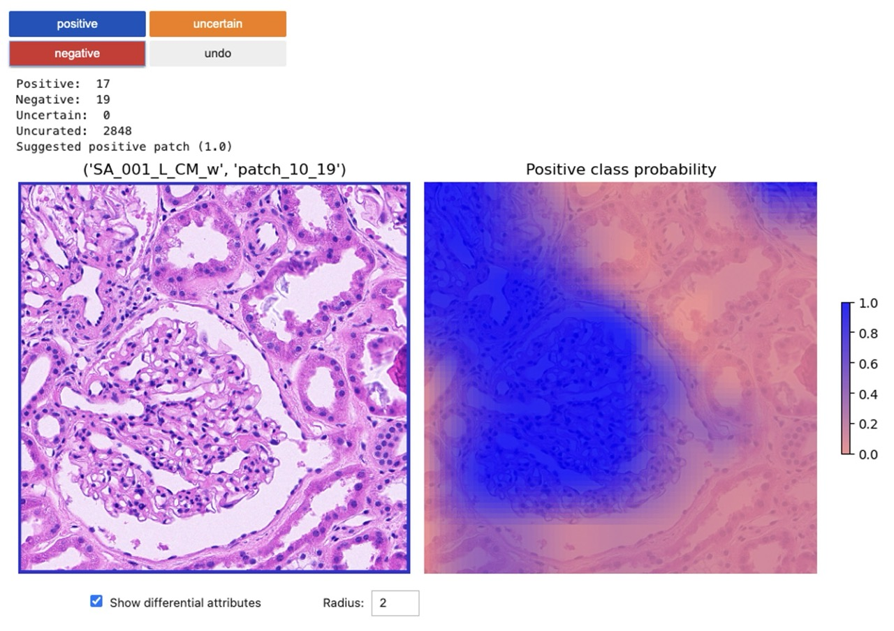
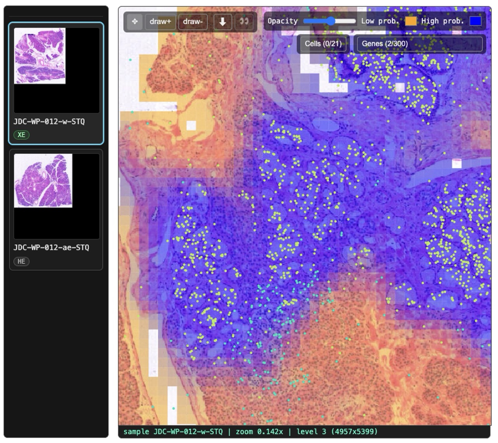

<div style="text-align: center; width: 500px; margin: 0 auto;">

</div>
<br>


# Segmentation-free localization of histology differential attributes

## About

DIANNE provides four complementary workflows for weakly-supervised training of spatial classifiers on histology and molecular imaging data. The histology interactive workflow enables real-time labeling and retraining on whole slide images (WSIs) via an active learning algorithm for rapid human-in-the-loop curation. The histology static workflow supports weakly supervised learning from image-level annotations (e.g. H&E, IHC, or mIF slides). The molecular interactive workflow allows real-time annotation with molecular data overlaid on histology patches, making it easy to incorporate both morphology and molecular markers into classifier training. Finally, the molecular static workflow extends this to spatial transcriptomics data (e.g. Visium, Xenium), linking molecular features such as genes, pathways, or cell types to histology image patches. Once trained, classifiers are deployed for spatial inference across whole slide images in under 30 seconds per slide.

<div align="left">
    <summary><strong>Citation</strong></summary>
    <blockquote>
      <b>DIANNE: Segmentation-Free Localization of Histology Differential Attributes</b><br>
      Sergii Domanskyi, Jill C. Rubinstein, Todd B. Sheridan, Adam Thiesen, Javad Noorbakhsh, Juliana Alcoforado Diniz, Ramalakshmi Ramasamy, Dylan S. Baker, Riley Sheldon, Qian Wu, George Kuchel, Paul Robson, Jeffrey H. Chuang<br>
      <i>bioRxiv</i> 2026.04.28.721103; <a href="https://doi.org/10.64898/2026.04.28.721103">https://doi.org/10.64898/2026.04.28.721103</a>
    </blockquote>
</div>

## Input data requirements

All DIANNE workflows operate on standardized, processed WSIs. Raw slides are prepared through one of two preprocessing pipelines. In practice, users simply run STQ or MIE on their slides and point DIANNE to the output directory — no additional data preparation is required.

+ STQ https://github.com/TheJacksonLaboratory/STQ — normalizes H&E and IHC slides, generates tile grids, and extracts tile-level imaging features via histopathology foundation models (CTransPath, MoCoV3, UNI/UNI2, InceptionV3, or CONCH).
+ MIE https://github.com/TheJacksonLaboratory/spatial-omics-tools — extends STQ with support for mIF WSIs, extracting tile-level imaging features via the KRONOS spatial proteomics foundation model.


## Graphical user interface (GUI)

<div style="text-align: center; width: 800px; margin: 0 auto;">
  
  <p style="text-align: left;"><em><b>Figure 1. Guided labelling GUI.</b> Patches proposed by the algorithm are presented to the user one at a time, and labelled as positive or negative using the corresponding buttons. Patches are drawn from all loaded whole slide images simultaneously and pooled for model training.</em></p>
</div>

<br>

<div style="text-align: center; width: 800px; margin: 0 auto;">
  
  <p style="text-align: left;"><em><b>Figure 2. Freehand labelling GUI.</b> The user navigates a single whole slide image by clicking on the thumbnail on the left and then by zooming and panning the user draws positive or negative contours to label regions of interest based on their own visual judgment. Annotations from all slides are accumulated and pooled for model training.</em></p>
</div>


## Launching DIANNE from Open OnDemand at JAX

DIANNE can be launched directly from the Open OnDemand (OOD) web portal, providing a convenient graphical interface for users on supported HPC clusters. The OOD app for DIANNE is open source and available at: [https://github.com/TheJacksonLaboratory/ood-spatial-tools](https://github.com/TheJacksonLaboratory/ood-spatial-tools)

**How to launch DIANNE via Open OnDemand:**

1. Log in to your JAX's Open OnDemand portal https://ondemand-test.jax.org   using your HPC credentials.
2. Navigate to the "Apps" section and select the DIANNE.
3. Optionally adjust parameters (e.g., resources, working directory) and launch the session.
4. Wait for the session to start, click the blue button "Connect to DIANNE" to open the server in your Google Chrome browser.
5. Navigate to a desired demonstration or analysis notebook.
6. Execute cells of the notebook to begin data interaction.

This method allows you to use DIANNE without manual installation or command-line setup, leveraging the resources of your HPC environment.

---

## Running DIANNE workflows on a local machine or HPC

**Clone DIANNE repository**

    workdir="/path/to/workdir/"
    cd $workdir

    git clone https://github.com/TheJacksonLaboratory/DIANNE.git

**Set up Python and Jupyter environment**

<details open><summary>Option A (click to expand). Use local environment. Create conda environment, and install packages into it, launch Jupyter server</summary><p>

```bash
conda create --name dianne python=3.10 -y
conda activate dianne
conda install -y -c conda-forge jupyter ipywidgets ipykernel "notebook>=7" numpy numba pandas pyarrow scanpy scipy scikit-image scikit-learn matplotlib tifffile imagecodecs tqdm opencv zarr fsspec

jupyter notebook
```

</p></details>
<br>

<details closed><summary>Option B (click to expand). Allocate an HPC node. Use an existing copy of the singularity container. If not available, pull from quay.io, launch Jupyter server</summary><p>

```bash
module load singularity
container="/projects/chuang-lab/USERS/domans/containers/annotator_v3.0.0.sif"

if [ ! -f "$container" ]; then
    echo "Container not found, pulling from registry..."
    singularity pull oras://quay.io/jaxcompsci/annotator:v2.0.0 &&\
    container="annotator_v2.0.0.sif"
fi

singularity exec "$container" jupyter notebook --no-browser --port=$(shuf -i10000-11999 -n1) --ip=$(hostname -i) --notebook-dir "$workdir"
```

</p></details>
<br>

<details closed><summary>Option C (click to expand). Launch Jupyter server via script below</summary><p>

```bash
cd scripts/
launch-jupyter.sh
```

</p></details>
<br>


**Navigate to Jupyter**

> **Important:** For full interactive functionality, DIANNE requires a modern browser with robust JavaScript support. Please use **Google Chrome** to ensure all interactive features work correctly. Other browsers may not support all JavaScript-based components used by DIANNE.


Copy the Jupyter server URL and paste into a browser (e.g., Google Chrome, preferred) and navigate to a demo notebook at `./scripts` directory.

---

## Credits

DIANNE was developed and is maintained by the Computational Sciences team at The Jackson Laboratory (JAX). The project is the result of collaborative efforts from researchers and clinicians dedicated to advancing computational pathology and spatial omics analysis.

We are committed to open science and welcome contributions, feedback, and collaboration from the community. If you use DIANNE in your research or work, please cite appropriately and consider sharing your experience with us.

For questions, support, or to get involved, please contact the JAX Computational Sciences team or open an issue on our repository.

DIANNE is released under the terms of the [LICENSE](LICENSE).

See ACKNOWLEDGEMENTS for third-party licenses.
